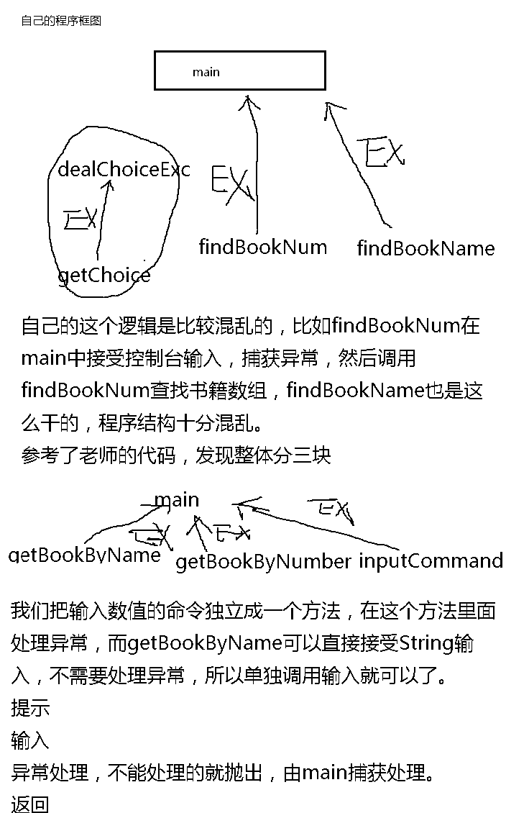

#Java异常处理之模拟借书系统

##题目要求
1. 定义字符串数组保存图书信息，下标+1就表示图书序号
2. 提示用户输入，分别“书名”和“图书序号”查找图书
3. 根据输入信息进行适当的异常处理
  1. 如果输入类型错误，抛出“错误命令异常”，并提示重新输入
  2. 如果书名不存在，抛出“图书不存在异常”，并提示重新输入
  3. 如果图书序号超过字符串数组范围，抛出“图书不存在异常”，并提示重新输入

##运行效果

##关于异常处理的经验总结
1. 处理运行时异常时，采用逻辑去合理规避的同时要辅助try-catch处理
2. 在多重catch块后面，可以加一个catch(Exception e)来处理可能会被遗漏的异常
3. 对于不确定的代码，也可以加上try-catch，处理潜在的异常
4. 尽量去处理异常，切记只是简单地调用printStackTrace()去打印输出
5. 根据不同的业务需求和异常类型来处理异常
6. 尽量添加finally语句块释放占用的资源

##代码分析和总结


##语法总结
1. 异常其实也是一种类，一切皆对象
2. 提示信息放在try块外面，try块里面放可能抛出异常值的方法调用
3. 整形命令输入方法通过返回不同的值，表示不同的命令状态，所谓的异常处理就是不同的返回值
   由调用者根据方法返回值做出不同的处理，用switch做选择判断器
4. 而其他方法则是直接抛出异常给main()，而不是通过返回值的方式，当然也可以通过返回值，
   然后由调用者间接根据返回值处理异常，但是在只要抛出一个异常，而不是返回3个以上状态值
   的情况下，不要这么做
5. 为了统一由调用者main()做出异常处理，对于需要捕获方法内的下层调用异常的方法，使用了异常链
   的手段传递异常到调用者main()
```java
int a;
char c = (char) a;  //把ASCII转换成字符
String b=  String.valueOf(c); //把字符转换成字符串
int d= Integer.parseInt(b); //把字符串转换成数字
```

##小结
1. 异常处理不熟练，可以先写出不含异常处理的代码，然后在此基础上加入异常处理
2. 及时保存可以运行的阶段性成果，便于出错时回滚
3. 先自己运行出效果，然后再看答案的思路
4. 根据关键字查找官方文档，再自己思考，或者搜stackoverflow
5. **熟练使用调试工具很重要，这个过程有助于理解程序**
6. 发现和参考代码的结构出入很大，看来学习还是要系统性
7. 不能熬夜，思路全乱了

---
##问答
问题和解答来自网友，不保证正确性，如果发现更好的解答，可以用 Issues 一起讨论或者直接添加修改哈 :smile:
>其实我觉得要实现这道题的功能并不难，但是，怎么样完美的实现代码的封装以及减少代码量才是我头疼的...例如对于这种判断名字和编号是否正确的方法是否可以封装等等问题。我觉得在测试类里代码越少越好，最好只要一句话调用一个方法就好了。还有对于业务的分析我感觉也遇到了障碍，从逻辑上来说，选书应该是人的方法，让人选书是图书馆的方法，我是否应该再创建一个人类，和一个图书馆类？

图书馆借书系统整体上作为一个类对待，其中涉及属性和方法。   
不需要创建人类吧，毕竟这里只需要获取控制台的命令，如果是真实的借书系统，可能会涉及到人类的创建，比如学生或者教职工；    
这里我们尽量从全局上划分系统的实现方法，比如： 

1. 按照书名选书模块；
2. 安装序号选书模块；
3. 命令接受模块；

可以发现有了以上三个功能方法，该系统的功能就都实现了。   
**尽量把和这些功能相关的组件都封装到该方法里，而不要放到主调用方法里，主方法只负责接受返回值和处理抛出的异常。**    
然后用主方法，分布调用这些模块，处理这些模块抛出的异常即可。   


